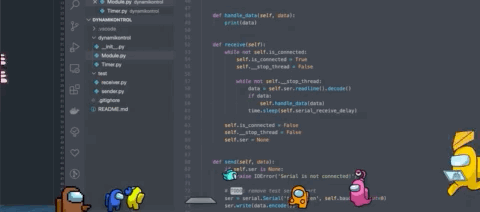

# Animated Wallpaper Sticker
Following the instruction about PyQt5 of an Youtuber, the script is repeated. 

Put gif animations of amongus characters on your desktop.

Reaction to click will be added.



## Run

```
python Sticker.py
```

## Usage

```
s7 = Sticker('gif/amongus/magenta.gif', xy=[1500, 900], size=0.5, on_top=True)
s7.walk(from_xy=[1400, 900], to_xy=[1600, 900], speed=180)
```

- Use `gif/amongus/magenta.gif` file
- Put the gif animation to `(1500, 900)` screen coordinates (x, y) -> initial position
- Resize the image to `50% (0.5)`
- Always on top to `True`
- Move the image from `(1400, 900)` to `(1600, 900)` with velocity `180`

## Have Fun!
